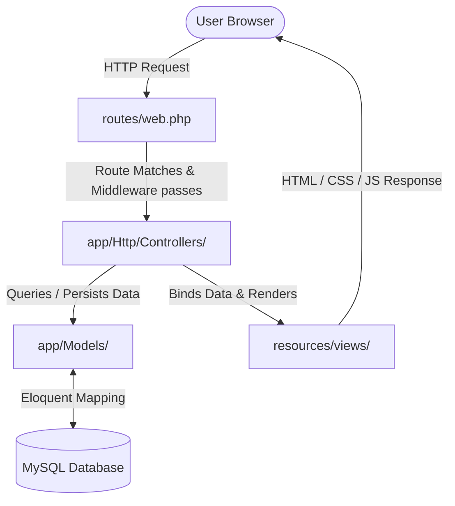
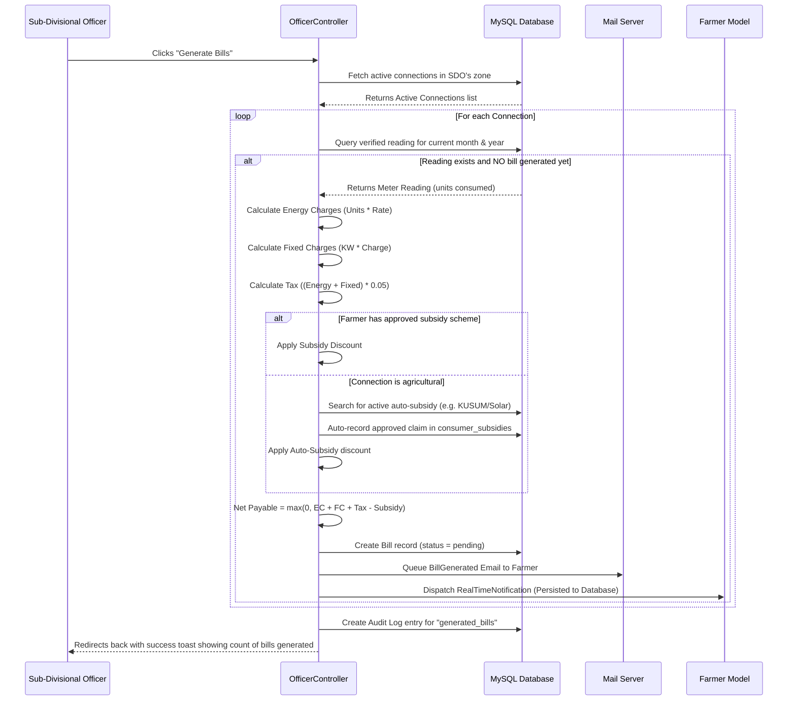

# ⚡ Agricultural Electric Power Distribution Portal
### Rajasthan Ministry of Power — Comprehensive Technical Review, Tutorial & Viva Preparation Guide

This document is a comprehensive technical masterclass, operation guide, and academic preparation manual for the **Rajasthan Agricultural Electric Power Distribution Portal**. It is designed to prepare you for any project defense, viva voce, or technical evaluation, ranging from basic concepts to advanced software architecture.

---

## 📂 Table of Contents
1. **Overview of Project Working (End-to-End Lifecycle)**
2. **System Architecture & MVC Mapping**
3. **Core Technologies & Topics Taught (Fundamentals to Advanced)**
4. **Deep-Dive Workflows (Step-by-Step Code Execution)**
5. **"What If" Scenarios & Customization Guide (Impact Analysis)**
6. **Detailed Viva Question & Answer Bank (80+ Questions)**
7. **Comprehensive MCQ Bank (with Answers and Explanations)**

---

## 1. Overview of Project Working (End-to-End Lifecycle)

The **Agricultural Electric Power Distribution Portal** is designed to digitize public utility operations. The working flow mimics the real-world operational cycle of an electrical distribution utility (like the Rajasthan Vidyut Vitran Nigam Limited). Below is the sequential walkthrough of how the system works end-to-end:

```
[Farmer Registers] ──> [Applies for Connection] ──> [SDO Approves connection & assigns Tariff]
                                                                        │
[Farmer Pays Bill] <── [SDO triggers Billing Run] <── [Lineman submits verified meter reading]
       │
[Fires Outage Report] ──> [3 reports in 30 mins] ──> [Auto-Priority Grievance opened for SDO]
```

### Step 1: Farmer Registration & Profile Verification
*   **Action:** A farmer visits the registration portal, inputs their personal details (Name, Phone, Address, Village, District, State), enters their **12-digit Aadhaar Number**, and selects their power distribution **Zone**.
*   **System Operation:** The database runs a validation query to ensure the email, phone number, and Aadhaar number are unique. Upon clicking register, the system generates a unique identifier using the format `KV-YYYY-XXXX` (where `YYYY` is the current registration year, and `XXXX` is a sequential index).
*   **Result:** The farmer account is saved with `is_active = true` and they are logged into their dashboard.

### Step 2: Applying for a Connection
*   **Action:** The farmer clicks "Apply for Connection" from their dashboard. They specify the connection type (e.g., *Tubewell Pump*, *Irrigation Motor*, *Thresher*, or *Drip Irrigation*), name their field for classification (e.g., "North Wheat Field"), and declare the **Sanctioned Load** in Kilowatts (kW).
*   **System Operation:** The backend starts a secure transaction. It evaluates past connections, locks the table, and assigns a sequential connection tracking number in the format `KV-CN-XXXXX` (e.g., `KV-CN-00001`). The initial status is saved as `'pending'`.
*   **Result:** A notification is dispatched to all SDOs assigned to the farmer's Zone.

### Step 3: SDO Connection Review & Approval
*   **Action:** The Sub-Divisional Officer (SDO) logs into their officer dashboard and finds the request under "Pending Connections". They review the farmer's details, select the appropriate **Tariff Category** (configured by the Admin), and click "Approve".
*   **System Operation:** Inside [OfficerController.php](file:///d:/power-distribution-agriculture/app/Http/Controllers/OfficerController.php), the `approveConnection()` action uses a database transaction to locate the last generated meter ID (`MT-XXXXX`). It increments the suffix (e.g., `MT-10001` to `MT-10002`), saves the meter number, assigns the selected tariff, sets the status to `'active'`, and updates the activation date to `now()`.
*   **Result:** An automated email is dispatched to the farmer, and a real-time database notification flashes on their dashboard indicating their meter is active.

### Step 4: Lineman Readings Submission
*   **Action:** At the end of the month, the field lineman logs into their mobile dashboard. They select active connections in their assigned zone and record the current meter dial reading.
*   **System Operation:** In [LinemanController.php](file:///d:/power-distribution-agriculture/app/Http/Controllers/LinemanController.php), the lineman inputs the reading. The system requires **GPS Coordinates (Latitude & Longitude)** from the browser Geolocation API and a **Photo Upload** of the physical meter dial. The image is saved under the `public` storage disk inside `storage/app/public/readings/`.
*   **Result:** The reading is logged in the `meter_readings` table with `is_verified = false`.

### Step 5: SDO Reading Verification & Bill Generation
*   **Action:** The SDO reviews pending readings. They compare the lineman's entries against the uploaded meter photo and GPS coordinates to verify authenticity, then click "Verify". They then run the monthly billing cycle.
*   **System Operation:** The SDO triggers `generateBills()`. The system loops through all active connections. For each connection with a verified, unbilled reading in the current month:
    1.  Calculates **Energy Charges**: $\text{Units Consumed} \times \text{Tariff Unit Rate}$
    2.  Calculates **Fixed Charges**: $\text{Sanctioned Load (kW)} \times \text{Fixed Tariff Rate per kW}$
    3.  Calculates **Taxes**: $(\text{Energy Charges} + \text{Fixed Charges}) \times 0.05$ (5% standard tax)
    4.  Evaluates Subsidies: It checks if the farmer has an approved subsidy scheme (like KUSUM). If yes, it deducts the discount percentage up to the scheme's unit cap. If no subsidy is assigned, it auto-applies a default agricultural subsidy and creates an automated record in the `consumer_subsidies` table.
    5.  Calculates **Net Payable**: $\max(0, \text{Charges} + \text{Taxes} - \text{Subsidy})$
    6.  Creates a new `Bill` record with status `'pending'`.
*   **Result:** The farmer receives a real-time dashboard notification and an email enclosing the PDF invoice.

### Step 6: Farmer Payment Simulation
*   **Action:** The farmer logs in, navigates to "Bills & Payments", reviews the invoice, and clicks "Pay Now".
*   **System Operation:** The application displays a checkout interface. If Razorpay API keys are configured, it initializes a real digital transaction order. If not, it executes a simulated workflow, generating a mock transaction token (`TXN-...`), log, and updates the bill status to `'paid'`.
*   **Result:** The payment record is logged in the `payments` table, and the bill status is resolved.

### Step 7: Crowd-Sourced Outage Redressal
*   **Action:** If a transformer fails or power grid shuts down, multiple farmers log in and click "Report Outage" on their dashboards.
*   **System Operation:**
    1.  **Anti-Spam Filter:** Checks if the reporting farmer has already submitted an outage report within the last 30 minutes. If yes, it blocks the submission.
    2.  **Tracking:** Creates an `OutageReport` record mapping the zone.
    3.  **Threshold Trigger:** The backend queries reports from the last 30 minutes in the zone. If the count reaches **3 or more unique reports**:
        *   The system starts a transaction, locks the complaints table, and auto-generates a high-priority grievance ticket named `GRV-YYYY-XXXX` containing the description: `[CROWD-SOURCED AUTOMATED OUTAGE REPORT]`.
        *   It dispatches a warning notification to all SDOs assigned to the zone.
*   **Result:** The SDO views the high-priority outage grievance, assigns it to a lineman, and monitors resolution updates.

---

## 2. System Architecture & MVC Mapping

The application is built on the **Model-View-Controller (MVC)** software architectural pattern. MVC separates the application's concerns into three distinct layers, reducing coupling and improving maintainability:



### File-by-File Codebase Directory Map

Here is the exact mapping of where code files reside in the system:

| Module / Component | Target File | Purpose & Responsibilities |
| :--- | :--- | :--- |
| **Routing Configuration** | [web.php](file:///d:/power-distribution-agriculture/routes/web.php) | Maps URLs to specific Controller actions; applies authentication and role-based middleware. |
| **Authentication Logic** | [AuthController.php](file:///d:/power-distribution-agriculture/app/Http/Controllers/AuthController.php) | Manages user registration, login throttling, password resets, and session management. |
| **User Entity Mapping** | [User.php](file:///d:/power-distribution-agriculture/app/Models/User.php) | Represents a registered user. Casts fields (e.g., `is_active` to boolean) and maps connections. |
| **Farmer Dashboard & Actions** | [FarmerController.php](file:///d:/power-distribution-agriculture/app/Http/Controllers/FarmerController.php) | Manages connection applications, bill payment simulation, grievance reports, and crowd-sourced outages. |
| **Officer Dashboard (SDO)** | [OfficerController.php](file:///d:/power-distribution-agriculture/app/Http/Controllers/OfficerController.php) | Handles connection approvals, tariff assignments, reading verifications, power schedules, and billing cycles. |
| **Lineman Dashboard** | [LinemanController.php](file:///d:/power-distribution-agriculture/app/Http/Controllers/LinemanController.php) | Allows field personnel to submit monthly meter readings with GPS coordinates and photos. |
| **System Administration** | [AdminController.php](file:///d:/power-distribution-agriculture/app/Http/Controllers/AdminController.php) | Enables admins to create SDO/linemen accounts, configure tariff rates, establish subsidy schemes, and read audit trails. |
| **Role Enforcement** | [RoleMiddleware.php](file:///d:/power-distribution-agriculture/app/Http/Middleware/RoleMiddleware.php) | Intercepts requests to ensure the logged-in user matches the role required for that route group. |
| **Real-Time Alerts** | [RealTimeNotification.php](file:///d:/power-distribution-agriculture/app/Notifications/RealTimeNotification.php) | Formulates notifications, persisting them in the database for asynchronous AJAX polling. |
| **Notification Fetcher** | [NotificationController.php](file:///d:/power-distribution-agriculture/app/Http/Controllers/NotificationController.php) | Returns active unread notifications in JSON format for the polling frontend engine. |

---

## 3. Core Technologies & Topics Taught

To successfully defend your project, you must understand the fundamentals of the language, framework, and databases employed.

### A. PHP 8.1+ Language Features
The codebase takes advantage of modern PHP features that optimize syntax and runtime performance:
*   **Constructor Property Promotion:** Allows you to declare and initialize class properties directly in the constructor signature, removing boilerplate assignments.
*   **Union Types:** Enables declaring that a variable or parameter can accept multiple types (e.g., `string|int`).
*   **Match Expression:** A strict, type-safe evolution of the `switch` statement that returns values directly. We use this in the [RoleMiddleware](file:///d:/power-distribution-agriculture/app/Http/Middleware/RoleMiddleware.php) to determine redirect paths:
    ```php
    return match (auth()->user()->role) {
        'admin' => redirect()->route('admin.dashboard'),
        'sdo' => redirect()->route('officer.dashboard'),
        'lineman' => redirect()->route('lineman.dashboard'),
        default => redirect()->route('farmer.dashboard'),
    };
    ```
*   **Null Coalescing Assignment Operator (`??=`):** Assigns a value to a variable if it is null or unset.

### B. Laravel 10 Framework Architecture
*   **Service Container:** The core engine of Laravel. It is a powerful tool for managing class dependencies and performing dependency injection (DI). Instead of manually instantiating classes using `new`, you request them in method signatures, and Laravel resolves and injects them automatically.
*   **Service Providers:** The bootstrapping hubs of Laravel. Files like `AppServiceProvider` and `RouteServiceProvider` tell Laravel how to bind services in the container, load routes, and set global variables.
*   **HTTP Middleware:** Functions that filter incoming HTTP requests. The request flows from the server through middleware layers (e.g., checking if authenticated, verifying CSRF, verifying role) before reaching the controller.
*   **Facades:** Provides static interfaces to classes that are bound in the Service Container. For example, `Route::get(...)`, `DB::transaction(...)`, and `Auth::user()` are Facades. They make syntax clean and readable while retaining testability.

### C. Database Layer & Eloquent ORM
*   **Eloquent ORM (Object-Relational Mapping):** Laravel's implementation of the ActiveRecord pattern. Every database table has a corresponding Eloquent Model class (e.g., `User` model matches the `users` table). Database columns are accessed as object properties.
*   **SQL Injection Prevention:** Eloquent automatically uses PDO parameter binding for all queries. This ensures that user inputs are treated as data, not executable SQL commands, preventing attacks.
*   **N+1 Query Issue & Eager Loading:**
    *   *The Problem (N+1):* If you load 10 connections and query their consumer's names in a loop, Laravel runs 1 query to get the connections, and then 10 separate queries to get the user for each connection (1 + 10 = 11 queries).
    *   *The Solution:* **Eager Loading** using the `with()` method.
        ```php
        $connections = Connection::with('consumer')->get();
        ```
        This runs only 2 database queries: one for all connections, and one for all matching consumers, saving database overhead.
*   **Database Transactions (`DB::transaction`):** Bundles multiple database changes into a single block. If any step fails (throws an exception), the entire transaction rolls back, restoring the database to its original state. This keeps data consistent.
*   **Row-Level Locking (`lockForUpdate()`):** When generating sequential numbers (like a meter ID `MT-10001` or connection code `KV-CN-00001`), two users might query the DB at the exact same millisecond. If both see the same maximum value, they will generate duplicate numbers. Adding `lockForUpdate()` queries the row and places an exclusive lock on it, forcing the second query to wait until the first transaction commits.

### D. Security Fundamentals
*   **Cross-Site Request Forgery (CSRF) Protection:** Protects applications from unauthorized actions executed by malicious sites on behalf of a logged-in user. Laravel generates an encrypted token for each active session. Forms must contain `@csrf` (which injects a hidden token field). The `VerifyCsrfToken` middleware validates that the token submitted matches the user's session token.
*   **Bcrypt Password Hashing:** Plain-text passwords are never stored. Laravel hashes passwords using Bcrypt. Hashing is a one-way mathematical function; you cannot decrypt a hash back into a password. Laravel's hashing is configured in the `password` field cast inside the [User](file:///d:/power-distribution-agriculture/app/Models/User.php) model: `'password' => 'hashed'`.
*   **Route Throttling (`throttle`):** Used to prevent brute-force dictionary attacks. On login and registration, we apply `throttle:5,1` which locks out an IP address for 1 minute if they execute more than 5 attempts.

---

## 4. Deep-Dive Workflows (Step-by-Step Code Execution)

Let's dissect the core operations of the application step-by-step from the perspective of code execution.

### A. The Billing Engine Workflow
The SDO triggers the billing run in the SDO Dashboard, running the `generateBills()` method inside [OfficerController.php](file:///d:/power-distribution-agriculture/app/Http/Controllers/OfficerController.php#L167-L265):



#### Detailed Calculations:
*   **Energy Charge (EC):** `Units Consumed` $\times$ `Rate Per Unit`
*   **Fixed Charge (FC):** `Sanctioned Load (kW)` $\times$ `Fixed Rate per kW`
*   **Tax:** $(EC + FC) \times 0.05$
*   **Net Payable:** $\max(0, EC + FC + \text{Tax} - \text{Subsidy})$

---

### B. Crowd-Sourced Outage Redressal Workflow
Filing reports and raising grid alerts happens in `reportOutage()` inside [FarmerController.php](file:///d:/power-distribution-agriculture/app/Http/Controllers/FarmerController.php#L468-L563):

1.  **Anti-Spam Check:** The controller queries `OutageReport` for a record matching the logged-in farmer's ID within the last 30 minutes. If found, it halts execution and redirects back with a validation warning.
2.  **Log Entry:** If allowed, the system creates a new `OutageReport` mapping the `farmer_id`, `zone_id`, and `reported_at` (current timestamp).
3.  **Threshold Check:** The database counts the number of outage reports in the user's zone submitted within the last 30 minutes:
    ```php
    $reportCount = OutageReport::where('zone_id', $zoneId)
        ->where('reported_at', '>=', now()->subMinutes(30))
        ->count();
    ```
4.  **Auto-Grievance Generation:** If `$reportCount >= 3`, the engine checks if there is already an active, unresolved crowd-sourced complaint (type: `no_supply`, priority: `high`, containing the string `[CROWD-SOURCED AUTOMATED OUTAGE REPORT]`).
5.  **Database Transaction:** If no active ticket exists, a `DB::transaction()` starts. A row-level lock evaluates the last complaint ID to assign a sequential grievance tracking number (e.g., `GRV-2026-0012`).
6.  **Ticket Creation:** A `Complaint` record is created:
    *   **Type:** `no_supply`
    *   **Priority:** `high`
    *   **Description:** `[CROWD-SOURCED AUTOMATED OUTAGE REPORT] Critical: Multiple farmers (3+) in this zone have reported a power outage...`
7.  **SDO Notification:** The code fetches all SDOs assigned to this zone:
    ```php
    $officers = User::where('role', 'sdo')->where('zone_id', $zoneId)->get();
    ```
    It sends a `RealTimeNotification` to their dashboards. A warning toast flashes on their screens.

---

### C. Verification & Security in Lineman Reading Submissions
Linemen submit readings via `storeReading()` in [LinemanController.php](file:///d:/power-distribution-agriculture/app/Http/Controllers/LinemanController.php):
*   **GPS Capture:** The system captures the latitude and longitude from the lineman's device browser geolocation API. These parameters (`gps_lat`, `gps_lng`) are required in the POST body to prove the lineman's physical presence at the farmer's land.
*   **Photo Verification:** Linemen upload a photograph of the physical dials on the meter. The file is saved using the public storage disk:
    ```php
    $path = $request->file('meter_photo')->store('readings', 'public');
    ```
*   **Audit Integration:** The database saves the photo path, coordinates, and timestamp, keeping the submission marked as `is_verified = false` until the SDO reviews and clicks "Verify" in the operations room. This audit pipeline eliminates manual reading fraud.

---

## 5. "What If" Scenarios & Customization Guide

Examiners frequently ask "What if" questions to test if you wrote the code yourself or simply downloaded a template. Here is how to handle these questions.

### Scenario A: "What if we change the billing Tax Rate from 5% to 8%?"
*   **Where to modify:** Open [OfficerController.php](file:///d:/power-distribution-agriculture/app/Http/Controllers/OfficerController.php) and navigate to the `generateBills()` method (around line 184).
*   **Code change:**
    ```diff
    - $tax = ($ec + $fc) * 0.05;
    + $tax = ($ec + $fc) * 0.08;
    ```
*   **System Impact:**
    *   Any *future* bills generated by the billing engine will automatically apply an 8% tax rate.
    *   *Retroactive Impact:* Past bills remain unaffected because they are already stored as static decimals inside the database's `bills` table under the `taxes` and `net_payable` columns. This prevents historical audit discrepancies.

---

### Scenario B: "What if we change the outage crowd-source threshold from 3 to 5 reports?"
*   **Where to modify:** Open [FarmerController.php](file:///d:/power-distribution-agriculture/app/Http/Controllers/FarmerController.php) and look for the `reportOutage()` method (around line 501).
*   **Code change:**
    ```diff
    - if ($reportCount >= 3) {
    + if ($reportCount >= 5) {
    ```
*   **System Impact:**
    *   The portal will require 5 unique farmers in the same zone to submit outage reports within a 30-minute window before an automated grievance ticket is opened and SDOs are notified. 
    *   If only 4 report, the reports will simply be tracked in the `outage_reports` table, but no emergency complaint will fire.

---

### Scenario C: "What if we make the portal multilingual (English & Hindi)?"
*   **Where to modify/add:** 
    1.  Create translation dictionaries in `lang/en.json` and `lang/hi.json`.
    2.  Write a route to save selection:
        ```php
        Route::get('/lang/{locale}', function($locale) {
            if (in_array($locale, ['en', 'hi'])) session(['locale' => $locale]);
            return back();
        })->name('lang.switch');
        ```
    3.  Create a custom middleware `SetLocaleMiddleware` that checks the session and sets the app language:
        ```php
        App::setLocale(session('locale', 'en'));
        ```
    4.  Register it in `app/Http/Kernel.php` under the `$middlewareGroups['web']` stack.
    5.  Change static text in blade files (e.g., `<h2>Dashboard</h2>`) to `<h2>{{ __('Dashboard') }}</h2>`.

---

### Scenario D: "What if the SDO rejects a connection instead of approving it?"
*   **Where to modify:** [OfficerController.php](file:///d:/power-distribution-agriculture/app/Http/Controllers/OfficerController.php) in `rejectConnection()`.
*   **Code execution flow:**
    *   The connection record's `status` column is updated to `'rejected'`.
    *   An audit log record is created mapping the rejected SDO's ID.
    *   *Difference from approval:* No database lock is placed on the meter numbering system, and no meter ID is generated. The farmer's connection list will simply display a red status badge indicating rejection.

---

## 6. Detailed Viva Question & Answer Bank

### Category A: Core MVC and Project Mechanics

#### Q1. What is the main purpose of this project, and who are its users?
**Answer:** The portal digitalizes agricultural power distribution in Rajasthan. It coordinates four user roles:
1.  **Admin:** Configures tariffs, registers zones, creates SDOs/linemen accounts, and reviews audit logs.
2.  **SDO (Officer):** Approves new connection requests, verifies meter readings, triggers monthly billing, and assigns/resolves complaints.
3.  **Lineman:** Submits readings (with GPS & photo verification) and marks assigned complaints as in-progress or resolved.
4.  **Farmer:** Registers via Aadhaar verification, requests electricity connections, views usage, pays bills, and files outage reports or complaints.

#### Q2. Where is the main routing file of this application located?
**Answer:** In the project root under [routes/web.php](file:///d:/power-distribution-agriculture/routes/web.php). It defines all web end-points, named routes, and route middleware wrappers.

#### Q3. What is the role of Eloquent models, and where are they defined?
**Answer:** Eloquent models map the database tables into object-oriented PHP classes. They are stored inside the `app/Models/` folder. Examples include:
*   [User.php](file:///d:/power-distribution-agriculture/app/Models/User.php) $\rightarrow$ `users` table
*   [Connection.php](file:///d:/power-distribution-agriculture/app/Models/Connection.php) $\rightarrow$ `connections` table
*   [Bill.php](file:///d:/power-distribution-agriculture/app/Models/Bill.php) $\rightarrow$ `bills` table

#### Q4. What is mass assignment in Laravel, and how does your project protect against it?
**Answer:** Mass assignment is a vulnerability where a malicious user sends unexpected HTTP request parameters (like adding `role = 'admin'` to a registration form) that are passed directly to the database create/update model method. We prevent this by explicitly declaring a `$fillable` array in our models. Only columns listed in `$fillable` can be inserted or updated using mass assignment methods like `create()` or `update()`.

#### Q5. How are database schema tables created and updated?
**Answer:** We use Laravel Migrations inside `database/migrations/`. Migrations act as version control for the database. We write them in PHP, and running `php artisan migrate` executes the corresponding SQL statement to build the database tables.

---

### Category B: Laravel Concepts & Architecture

#### Q6. What is the difference between `composer.json` and `composer.lock`?
**Answer:** 
*   `composer.json` lists the PHP dependencies of the application and their allowed version ranges (e.g., `"laravel/framework": "^10.0"`).
*   `composer.lock` stores the *exact* version of every package installed when the developer ran `composer install` or `composer update`. This guarantees that every environment (development, testing, production) runs identical library code.

#### Q7. Why do we run `php artisan key:generate` during installation?
**Answer:** This command generates a secure 32-character string and saves it under `APP_KEY` in the `.env` file. Laravel uses this key to encrypt cookies, session payloads, and encrypted database fields. If this key is missing, Laravel will throw a decryption/bootstrapping error and refuse to run.

#### Q8. What is middleware, and how is it registered?
**Answer:** Middleware operates as a filter on incoming HTTP requests. It is registered in [app/Http/Kernel.php](file:///d:/power-distribution-agriculture/app/Http/Kernel.php) under three lists: global middleware (runs on all requests), middleware groups (like `web` or `api`), and route middleware (aliased middlewares applied to specific routes like `auth` or `role`).

#### Q9. Explain your custom `RoleMiddleware` logic.
**Answer:** Located in [RoleMiddleware.php](file:///d:/power-distribution-agriculture/app/Http/Middleware/RoleMiddleware.php). It takes a parameter representing the required role (e.g., `role:admin`). It checks if the user is authenticated. If they are not logged in, it redirects them to the login screen. If their role (`auth()->user()->role`) does not match the required parameter, it redirects them to their correct home dashboard, ensuring users cannot access endpoints they do not have clearance for.

#### Q10. What is Blade, and why does it compile views?
**Answer:** Blade is Laravel's templating engine. It allows writing HTML mixed with control structures (like `@if`, `@foreach`, and `@auth`) and escaping values using double curly brackets `{{ $variable }}`. Blade files are saved as `.blade.php` in `resources/views/`. They are compiled into cached, raw PHP files in the storage directory, which eliminates performance overhead on subsequent requests.

#### Q11. How does Laravel prevent Cross-Site Scripting (XSS) in views?
**Answer:** When you render values using double curly brackets `{{ $data }}`, Laravel automatically passes the output through PHP's `htmlspecialchars()` function. This converts raw HTML characters (like `<` or `>`) into safe HTML entities (like `&lt;` and `&gt;`), rendering malicious script injections harmless. To deliberately bypass escaping (e.g. to print formatted rich text), we must use `{!! $data !!}`, which should be done with caution.

#### Q12. Explain the purpose of `php artisan storage:link`.
**Answer:** Files uploaded via the web portal are saved securely inside `storage/app/public/` (which is outside the public web root to prevent direct execution). To render these files (such as user avatars or physical meter readings) in HTML, the browser needs a public path. Running `storage:link` creates a symbolic link (symlink) from `public/storage` to `storage/app/public/`, mapping files into the public directory securely.

#### Q13. How does session-based authentication differ from token-based (JWT)?
**Answer:**
*   **Session-based (used in this project):** The server saves the user's login state in its filesystem/database and returns a session ID cookie to the browser. The browser sends this cookie on every request, which the server uses to match against the active session. This is secure and stateful, meaning sessions can be revoked immediately on the server.
*   **Token-based (JWT):** The server signs a payload containing user details and returns it to the client. The client stores it in local storage and includes it in HTTP headers. JWT is stateless, meaning the server does not need to store anything. However, JWT is harder to revoke instantly.

#### Q14. What are database seeders and factories?
**Answer:** Seeders are PHP scripts that populate the database with default records (e.g., creating the first admin account or setting default tariffs). Factories define templates to generate large volumes of realistic fake data for testing (like generating 100 fake farmers using a library called Faker). We run them using `php artisan db:seed`.

#### Q15. How do you handle file upload validation?
**Answer:** We validate file uploads in our controller validation schemas:
```php
$request->validate([
    'document' => 'required|file|mimes:pdf,jpg,png|max:2048' // Max 2MB
]);
```
This checks that a file was uploaded, limits the format to PDF/images (blocking malicious executable scripts), and ensures the file size does not exceed the allowed server memory.

---

### Category C: Project-Specific Implementation Details

#### Q16. How does the "Smart Bill Prediction Widget" calculate estimated usage?
**Answer:** In [FarmerController.php](file:///d:/power-distribution-agriculture/app/Http/Controllers/FarmerController.php#L67-L130), the dashboard calculates predictions by:
1.  Checking historical consumption for the last 6 months to establish a baseline average.
2.  Fetching the current month's reading (if submitted).
3.  Extrapolating daily usage:
    $$\text{Projected Units} = \left(\frac{\text{Current Units Consumed}}{\text{Days Elapsed in Month}}\right) \times \text{Total Days in Month}$$
4.  Applying the active tariff's unit rates and fixed charges to calculate an estimated bill.
5.  Setting `is_trending_high` to true if the projected units exceed the baseline average by 20% or more, letting the farmer know to conserve power.

#### Q17. Why do we wrap connection approvals inside a database transaction?
**Answer:** In connection approvals, we:
*   Read the last assigned meter number.
*   Increment the value (e.g., `MT-10001` $\rightarrow$ `MT-10002`).
*   Update the connection record.
*   Update the status and set the timestamp.

If another SDO approves a connection at the exact same millisecond and the operations are not in a transaction with locks, both SDO queries will read the same last meter ID, generating duplicate meter numbers. Transactions with `lockForUpdate()` ensure only one process reads and writes at a time.

#### Q18. How does the simulated payment engine differ from real Razorpay integration?
**Answer:** 
*   **Simulated flow:** If Razorpay credentials are not configured in `.env`, the controller generates a mock transaction token prefix (`TXN-YYYYMMDDHHMMSS-...`), creates a payment log, and sets the bill status directly to `'paid'`.
*   **Razorpay integration:** The controller initializes the Razorpay PHP SDK using API keys, generates an official order ID, loads the Razorpay payment window on the frontend, and verifies the response signature returned by the checkout widget before updating the bill status.

#### Q19. What is the default password for all seed database accounts?
**Answer:** The default password is `password`. This is configured inside `DatabaseSeeder.php` for ease of local testing and grading.

#### Q20. Where is the automated audit log written?
**Answer:** It is written to the `audit_logs` table via the `AuditLog` model. Important events (like changing tariff categories, deactivating users, or generating monthly bills) call `AuditLog::create([...])`, saving the operator's ID, action description, modified model reference, old and new values in JSON columns, and the operator's IP address.

#### Q21. How does the application prevent duplicate billing for the same month?
**Answer:** In [OfficerController.php](file:///d:/power-distribution-agriculture/app/Http/Controllers/OfficerController.php#L178), before generating a bill for a connection, the loop checks the `bills` table:
```php
if (Bill::where('connection_id', $conn->id)->where('billing_month', $cm)->where('billing_year', $cy)->exists()) {
    continue;
}
```
This check skips the connection if a bill already exists for the month, preventing duplicate charges.

#### Q22. Explain the parameters used in the auto-apply subsidy selection.
**Answer:** If a farmer has no pre-approved subsidy but has an active agricultural connection, the billing cycle searches for active default schemes using string matching:
```php
$autoScheme = SubsidyScheme::where('is_active', true)
    ->where('start_date', '<=', now())
    ->where('end_date', '>=', now())
    ->where(function($q) {
        $q->where('scheme_name', 'like', '%Agriculture%')
          ->orWhere('scheme_name', 'like', '%Solar%')
          ->orWhere('scheme_name', 'like', '%KUSUM%');
    })
    ->orderByDesc('discount_percentage')
    ->first();
```
It picks the eligible scheme with the highest discount rate to maximize the farmer's savings, then saves this assignment to the database.

#### Q23. What library is used to generate the PDF download of the bill?
**Answer:** We use the `Barryvdh\DomPDF` wrapper, which integrates **DomPDF** into Laravel. The view template `farmer.bill_pdf` is styled using CSS and compiled to a PDF stream inside the controller.

#### Q24. How is AJAX used in notifications?
**Answer:** The application layout script sets up a JavaScript polling function that calls the `/notifications/poll` endpoint every 8 seconds. The response returns a JSON array of new notifications. If there are new items, the frontend JavaScript dynamically renders slide-in toast notifications.

#### Q25. What happens if the database connection details in `.env` are wrong?
**Answer:** The application will return a `500 Internal Server Error` page with the message "Database connection refused" (if debug mode is enabled). In Laravel, database connection failures throw a `PDOException` because the framework cannot connect to MySQL to resolve session states or verify configurations.

#### Q26. Why do we store the old values and new values in the audit log as JSON?
**Answer:** Structured JSON columns allow storing variable lengths of change parameters. Instead of creating a column for each possible table field, we serialize the array of changed fields into a single text column. This allows the system to support audit logs for different tables (`users`, `tariffs`, `connections`) using a single database schema.

#### Q27. What is route throttling?
**Answer:** Route throttling is a rate-limiting feature. We define it as `throttle:attempts,minutes` in our routes. For example, `throttle:5,1` means a user can hit that route at most 5 times in 1 minute. If they exceed this, Laravel returns a `429 Too Many Requests` response.

#### Q28. What is carbon, and how is it used in the codebase?
**Answer:** **Carbon** is a PHP library that extends PHP’s native `DateTime` class. It simplifies date and time comparisons, additions, subtractions, and formatting. In this project, Carbon is used to handle due date offsets (e.g., `Carbon::now()->addDays(15)`), filter query dates, and format timestamps in human-readable intervals (e.g., `diffForHumans()`).

#### Q29. How does the lineman submit readings if they do not have network coverage in the field?
**Answer:** The current application is a standard web application requiring active connectivity. To support offline lineman submissions, we would implement a Progressive Web App (PWA) cache that registers a service worker to intercept submissions, write them locally to IndexedDB in the browser storage, and sync them back to the server once network connectivity is restored.

#### Q30. What is the purpose of the `.editorconfig` file in the root folder?
**Answer:** `.editorconfig` defines code style guidelines (such as indentation style, indent size, line endings, and character encoding) for team environments. Text editors and IDEs read this file to automatically format code, ensuring consistency across different developers.

#### Q31. What is the `.gitattributes` file?
**Answer:** It applies configurations to files within Git (e.g., defining line endings like LF or CRLF, or flagging binary files). This prevents formatting conflicts when collaborating across Windows and macOS/Linux systems.

#### Q32. How do you resolve a database connection timeout in a production environment?
**Answer:** 
1.  Check the database host credentials in `.env`.
2.  Ensure port `3306` (or the database port) is open on the hosting environment's firewall.
3.  Optimize slow database queries by adding indexes to commonly searched columns.
4.  Increase the connection timeout limit in the database configuration file (`config/database.php`).

#### Q33. Why do we set the session driver to `file` in development?
**Answer:** In development, using the `file` driver is simple because it does not require additional configuration (like Redis or database tables). It writes encrypted session state files directly to `storage/framework/sessions/`, which makes debugging simple.

#### Q34. How does Laravel handle database migrations behind the scenes?
**Answer:** Laravel tracks migrations in a special database table called `migrations`. When you run `php artisan migrate`, Laravel reads the migration files, checks this table to see which migrations have already run, and executes only the new migration files.

#### Q35. What is polymorphic relationship, and where is it useful?
**Answer:** A polymorphic relationship allows a target model to belong to more than one type of model using a single association. For example, in an audit log, the `model_type` could be `'App\Models\User'` or `'App\Models\Connection'`, while `model_id` stores the respective model's primary key. This avoids creating separate audit tables for every model in the system.

#### Q36. What is the default lifetime of a Laravel session?
**Answer:** By default, it is configured in `config/session.php` to run for 120 minutes (`SESSION_LIFETIME=120` in `.env.example`). If a user is inactive for 2 hours, their session expires, and they must log in again.

#### Q37. How can you optimize the performance of the Laravel billing engine?
**Answer:**
1.  Use database indexing on columns that are queried frequently (e.g., `status`, `zone_id`, `billing_month`, `connection_id`).
2.  Eager load relations to prevent N+1 query issues.
3.  Use background queues (Laravel Queues) to process billing calculations asynchronously. Instead of making the SDO wait for the page to load while generating thousands of bills, the calculation runs in the background.

#### Q38. What is the use of `public` directory in Laravel?
**Answer:** The `public` directory is the document root for the web server. It contains `index.php`, which is the entry point for all HTTP requests entering the application. It also stores assets like images, compiled CSS, and JavaScript.

#### Q39. What is a helper function? Give examples.
**Answer:** Helper functions are global functions that can be called anywhere in the application. Examples include:
*   `route('route.name')`: Generates a URL for a named route.
*   `view('view.name')`: Resolves a blade view template.
*   `auth()`: Returns the authentication manager instance.
*   `now()`: Returns a Carbon instance representing the current time.

#### Q40. How do you implement route groupings?
**Answer:** We use the `Route::group()` or chain helper methods. For example, we group routes by role middleware and assign prefixes or name namespaces to keep the route file clean:
```php
Route::middleware(['auth', 'role:admin'])->prefix('admin')->name('admin.')->group(function () {
    Route::get('/dashboard', [AdminController::class, 'dashboard'])->name('dashboard');
});
```

#### Q41. How are emails handled in Laravel?
**Answer:** Laravel provides clean mail services using the `Mail` facade. We define mail configurations (like SMTP host, port, username, password) in `.env`. We create mail classes using `php artisan make:mail`. In our controllers, we dispatch mail using:
```php
Mail::to($email)->send(new BillGenerated($bill));
```

#### Q42. Explain the purpose of `config/` directory.
**Answer:** The `config/` directory holds configuration files for all components of the framework, such as database connections, mail templates, file systems, and session drivers. These files read values from the `.env` file using the `env()` helper.

#### Q43. What is the bootstrap folder used for?
**Answer:** The `bootstrap/` folder contains files that initialize the Laravel framework, load the composer autoloader, and set up configuration file caching.

#### Q44. What is Vite?
**Answer:** **Vite** is a frontend build tool that compiles assets (like CSS and JS files) for development and production. It replaces Laravel Mix (Webpack) and offers faster compilation speeds.

#### Q45. Explain how the "Remember Me" functionality works.
**Answer:** If the user checks the "Remember Me" checkbox during login, Laravel generates a secure, random token and stores it in the `remember_token` column of the `users` table. It also sends a corresponding cookie to the user's browser. If their session expires, Laravel reads this cookie and logs them back in automatically.

#### Q46. What is the difference between `patch` and `put` HTTP methods?
**Answer:**
*   `PUT` replaces the entire target resource with the uploaded payload.
*   `PATCH` applies partial modifications to a resource (e.g., updating only a single field like a user status).

#### Q47. What is validation and why is it crucial on both client and server side?
**Answer:** Validation checks that user inputs meet criteria (like data type, length, and format) before processing.
*   **Client-side:** Improves user experience by catching errors instantly in the browser.
*   **Server-side:** Crucial for security, as client-side checks can be bypassed by attackers sending requests directly to the API endpoints.

#### Q48. How do you define a one-to-many relationship in Eloquent?
**Answer:** In the parent model, you return `hasMany()`. In the child model, you return `belongsTo()`.
For example, in [User.php](file:///d:/power-distribution-agriculture/app/Models/User.php):
```php
public function connections() { return $this->hasMany(Connection::class, 'consumer_id'); }
```
And in [Connection.php](file:///d:/power-distribution-agriculture/app/Models/Connection.php):
```php
public function consumer() { return $this->belongsTo(User::class, 'consumer_id'); }
```

#### Q49. What is Git, and what is the difference between `git pull` and `git fetch`?
**Answer:** Git is a distributed version control system.
*   `git fetch` downloads metadata about updates from the remote repository but does not merge those changes into your local files.
*   `git pull` downloads remote updates and automatically merges them into your active branch (equivalent to running `git fetch` followed by `git merge`).

#### Q50. How do you handle exceptions globally in Laravel?
**Answer:** Laravel handles exceptions in `app/Exceptions/Handler.php`. You can define custom rendering logic for specific exceptions (like returning a custom error view when a model is not found).

---

### Category D: Docker, Nginx, Deployments & Production (NEW)

#### Q51. What parent image does your project Dockerfile build upon? Why?
**Answer:** It builds on `FROM php:8.2-fpm` (in [Dockerfile](file:///d:/power-distribution-agriculture/Dockerfile#L1)). This image is a lightweight Debian-based distribution containing PHP 8.2 and FastCGI Process Manager (FPM). We install system utilities (Nginx, Node, composer) on top of it.

#### Q52. Explain the purpose of the `start.sh` startup script.
**Answer:** In container environments (like Render or Docker Compose), [start.sh](file:///d:/power-distribution-agriculture/docker/start.sh) automates initialization tasks at runtime:
1.  Binds the dynamic hosting port variable (`PORT`) to the Nginx template file.
2.  Creates essential log and framework directories inside `storage/` and updates permissions (`chmod 775`).
3.  Performs database checks before running migrations (`php artisan migrate --force`).
4.  Queries the user count; if the database is blank, it seeds it automatically (`db:seed`).
5.  Starts PHP-FPM in the background, waits for port `9000` to respond, and boots Nginx in the foreground to keep the container active.

#### Q53. Why do we run Nginx and PHP-FPM together inside the container?
**Answer:** Standard PHP deployments require a web server (Nginx) to receive HTTP requests, parse files, handle static files, and forward PHP requests to a process engine (PHP-FPM) via a socket. Running them inside a single container ensures easy port management (e.g., exposing only a single port like `10000` to the cloud host) without needing complex container networks.

#### Q54. What is the role of `fastcgi_pass 127.0.0.1:9000` inside your Nginx configuration?
**Answer:** Inside [nginx.conf](file:///d:/power-distribution-agriculture/docker/nginx.conf#L24-L30), when a request matches a `.php` file extension, Nginx passes the request payload using FastCGI protocol to PHP-FPM listening on localhost port `9000`. PHP-FPM executes the script and returns the HTML/JSON response to Nginx.

#### Q55. Why is `php artisan config:cache` cleared during container startup?
**Answer:** Cloud services (like Render) inject configuration secrets (like Database password, Razorpay keys) at runtime via environment variables. If configurations are cached during build time (`config:cache`), Laravel freezes these variables. Clearing the cache (`config:clear` in [start.sh](file:///d:/power-distribution-agriculture/docker/start.sh#L65)) ensures the application reads the latest injection values directly.

#### Q56. What does `ln -sf /dev/stdout /var/log/nginx/access.log` do?
**Answer:** This command creates a symbolic link between Nginx logs and stdout/stderr stream outputs (in [Dockerfile](file:///d:/power-distribution-agriculture/Dockerfile#L32)). Container logging agents read stdout. This link forwards server logs directly to the cloud dashboard (like Render console) in real time.

#### Q57. What are the key directories requiring write permissions (`chmod -R 775`) in Laravel?
**Answer:** The `storage/` and `bootstrap/cache/` folders. Laravel writes framework logs, file uploads, compiled Blade files, user session arrays, and cache indexes to these folders. If they are write-protected, Laravel returns permission exception crashes.

#### Q58. Explain how Nginx resolves static files versus dynamic routes.
**Answer:** Inside [nginx.conf](file:///d:/power-distribution-agriculture/docker/nginx.conf#L15-L17), the line `try_files $uri $uri/ /index.php?$query_string;` tells Nginx:
1.  Check if a file matching the exact URL directory exists under `public/` (e.g. an image). If yes, return it.
2.  If not found, forward the request to `/index.php` along with the query string. Laravel's routing engine then resolves it dynamically.

---

### Category E: Advanced Security, Integration & Operations (NEW)

#### Q59. What is SQL Injection, and how does PDO parameter binding prevent it?
**Answer:** SQL Injection is an attack where raw input data contains SQL commands (e.g. inputting `' OR '1'='1` in a login field) to bypass database checks. Eloquent uses PHP Data Objects (PDO) which separates the query structure from the user data:
*   *Query structure:* `SELECT * FROM users WHERE email = :email` (compiled first by MySQL).
*   *User data:* `:email` value is bound as a parameter. It is never parsed as SQL syntax, rendering injection payloads ineffective.

#### Q60. How does Razorpay verify that payment responses are legitimate?
**Answer:** Razorpay uses **HMAC (Hash-based Message Authentication Code)** SHA256 signatures. When a payment completes, Razorpay returns a `razorpay_payment_id`, `razorpay_order_id`, and `razorpay_signature`. The server uses these keys and the secret key to compute a hash. If it matches the signature, the transaction is verified.

#### Q61. What are database indexes, and where did we add them in our migrations?
**Answer:** Indexes are lookup tables created on specific database columns to speed up query sorting. We added indexes in [add_indexes_to_tables.php](file:///d:/power-distribution-agriculture/database/migrations/2026_05_11_033159_add_indexes_to_tables.php) on columns queried in joins or where checks (e.g., `user_id`, `connection_id`, `billing_month`, `status`, `zone_id`), speeding up dashboard loads.

#### Q62. What is the difference between encryption and hashing?
**Answer:**
*   **Hashing (Bcrypt):** A one-way function. You convert text to a fixed-length string, but you cannot convert the string back to the original text. It is used for passwords.
*   **Encryption (AES-256):** A two-way function. You encrypt data using a secret key and can decrypt it back to the original text using the same key. Used in Laravel cookies and sensitive credentials.

#### Q63. Explain the security risks of having `APP_DEBUG=true` in production.
**Answer:** If `APP_DEBUG` is true, when an error occurs, Laravel displays a detailed stack trace listing database queries, server file paths, environment variable keys, and library names. Attackers can exploit this sensitive information to locate vulnerabilities. In production, this must be set to `false`.

#### Q64. How does the notification system poll data? What are the limitations?
**Answer:** The client layout page runs a JavaScript `setInterval` function polling `/notifications/poll` every 8 seconds. This is simple to write but increases server load because each poll makes a database query. For high user counts, we would replace this with **WebSockets** (using Laravel Reverb/Pusher) to push notifications to clients instantly.

#### Q65. What is the purpose of polymorphic audit logging in your project?
**Answer:** The `AuditLog` model contains `model_type` and `model_id` columns. This allows a single audit log table to reference any model in the system (e.g. auditing a `User` status toggle, or a `TariffCategory` deletion). This avoids creating separate auditing logs for each table.

#### Q66. What library was used for data charts, and how does it load data?
**Answer:** **Chart.js** renders charts in HTML canvas elements. In [usage.blade.php](file:///d:/power-distribution-agriculture/resources/views/farmer/usage.blade.php), the JavaScript block calls `fetch()` to query `/farmer/usage/chart-data`. The controller returns a JSON object containing two arrays: month labels and usage values, which Chart.js parses to render the interactive graphs.

#### Q67. What are CSS Page Breaks, and why were they used in the DomPDF styles?
**Answer:** DomPDF does not automatically handle page breaks cleanly when converting HTML to PDF. Inside [generate_viva_pdf.php](file:///d:/power-distribution-agriculture/generate_viva_pdf.php#L81-L83) we use the CSS declaration:
```css
.page-break { page-break-after: always; }
```
We inject `<div class="page-break"></div>` at specific section ends in the HTML template to force the PDF engine to start a new page, keeping formatting neat.

#### Q68. Explain how the application prevents duplicate connection requests.
**Answer:** In [FarmerController.php](file:///d:/power-distribution-agriculture/app/Http/Controllers/FarmerController.php#L389-L390), when a farmer applies for a subsidy scheme, the controller checks the `consumer_subsidies` table before inserting a record:
```php
$existing = ConsumerSubsidy::where('consumer_id', Auth::id())->where('scheme_id', $request->scheme_id)->first();
if ($existing) return back()->withErrors(['scheme_id' => 'Already applied.']);
```
This blocks duplicate applications for the same scheme.

#### Q69. What is a git commit? What does `git log` show?
**Answer:** A git commit is a snapshot of your repository's files at a specific point in time, marked with a unique hash and author details. Running `git log` displays a chronological list of these commits, showing the changes made over time.

#### Q70. What is database normalization?
**Answer:** Database normalization is the process of organizing database tables to reduce data redundancy and improve data integrity. It splits large tables into smaller, related tables (e.g., separating user login credentials, user connections, and monthly bills).

#### Q71. How do you configure email notifications in a Laravel project?
**Answer:** Mail options are set in the `.env` file under keys like `MAIL_MAILER`, `MAIL_HOST`, `MAIL_PORT`, `MAIL_USERNAME`, `MAIL_PASSWORD`, and `MAIL_ENCRYPTION`. Laravel reads these configurations at runtime to connect to your SMTP server.

#### Q72. Explain the difference between `null` and `undefined` in JavaScript.
**Answer:**
*   `null` is an assigned value representing the intentional absence of any object value.
*   `undefined` means a variable has been declared but has not yet been assigned a value.

#### Q73. What is the difference between standard session storage and local storage in browsers?
**Answer:**
*   **Session Storage:** Retains data only while the browser tab is open. If the tab is closed, the data is deleted.
*   **Local Storage:** Persists data across browser sessions indefinitely until explicitly cleared via JavaScript or browser history settings.

#### Q74. How does PHP handle memory management?
**Answer:** PHP uses reference counting and a garbage collector. When a variable is no longer referenced, its memory is freed. The garbage collector runs periodically to detect and clean up circular references.

#### Q75. What is unit testing? What framework does Laravel use for testing?
**Answer:** Unit testing involves writing automated scripts to test individual code blocks (like validation checks or billing math) to ensure they behave correctly. Laravel uses **PHPUnit** (configured via `phpunit.xml` in the root folder) and Pest for writing these tests.

#### Q76. What is a REST API?
**Answer:** **REST (Representational State Transfer)** is an architectural style for design APIs. It utilizes standard HTTP methods (`GET`, `POST`, `PUT`, `DELETE`) and stateless communications to retrieve and modify resource records.

#### Q77. What is standard port for HTTP and HTTPS protocols?
**Answer:**
*   **HTTP:** Port `80`
*   **HTTPS:** Port `443`

#### Q78. Why do we write `npm install` and `npm run build`?
**Answer:**
*   `npm install` reads the `package.json` file to download frontend libraries (Tailwind CSS, Vite plugins) into the `node_modules/` folder.
*   `npm run build` executes Vite to compile and compress CSS/JS files into the `public/` directory for production.

#### Q79. What does the `.editorconfig` file enforce?
**Answer:** It configures code style guidelines (indentation type, tab width, trailing whitespace, character coding) across editors and IDEs to keep code clean and readable for development teams.

#### Q80. How would you debug a blank white screen issue in a Laravel application?
**Answer:** 
1.  Check that PHP has write access to the `storage/` and `bootstrap/cache/` directories.
2.  Inspect the latest error messages in `storage/logs/laravel.log`.
3.  Set `APP_DEBUG=true` in the `.env` file to render the detailed stack trace in the browser.

---

## 7. Comprehensive MCQ Bank

#### Q1. Which directory contains the configuration files for databases, sessions, and mailers in a Laravel project?
*   A) `app/Config`
*   B) `config/`
*   C) `resources/config`
*   D) `bootstrap/`
*   *Answer:* **B**
*   *Explanation:* The `config/` directory contains configuration files for all framework behaviors. These files read environment variables from the `.env` file.

#### Q2. What does the `VerifyCsrfToken` middleware check when a form is submitted?
*   A) If the user's password is correct
*   B) If the input matches database records
*   C) If the request payload contains a token matching the session token
*   D) If the browser supports JavaScript
*   *Answer:* **C**
*   *Explanation:* CSRF protection verifies that the encrypted token in the form submission matches the token stored in the user's active session, preventing unauthorized requests.

#### Q3. Which artisan command rolls back all database migrations and runs them again from scratch?
*   A) `php artisan migrate:rollback`
*   B) `php artisan migrate:reset`
*   C) `php artisan migrate:fresh`
*   D) `php artisan db:seed`
*   *Answer:* **C**
*   *Explanation:* `migrate:fresh` drops all tables from the database and re-runs all migrations, while `migrate:rollback` only rolls back the last batch of migrations.

#### Q4. What is the primary purpose of the `lockForUpdate()` method in Eloquent queries?
*   A) It encrypts rows to prevent modification
*   B) It places a write-lock on the queried database rows until the transaction commits
*   C) It automatically logs out the user
*   D) It formats numbers as currency values
*   *Answer:* **B**
*   *Explanation:* `lockForUpdate()` prevents race conditions by locking selected rows. Concurrent requests must wait for the current transaction to complete.

#### Q5. How does Laravel secure passwords inside the database?
*   A) Using MD5 encryption
*   B) Saving passwords in base64 format
*   C) Hashing passwords with Bcrypt
*   D) Saving passwords as plain text
*   *Answer:* **C**
*   *Explanation:* Laravel hashes passwords using Bcrypt by default (configured via the `'password' => 'hashed'` cast), which secures them from decryption attacks.

#### Q6. What does the `throttle:5,1` middleware do?
*   A) It speeds up query execution times
*   B) It limits a user to 5 requests per minute on those endpoints
*   C) It downloads files in 5-second intervals
*   D) It scales server CPU usage
*   *Answer:* **B**
*   *Explanation:* Throttling rate-limits endpoints to prevent brute-force login attempts or API abuse.

#### Q7. Which file contains named routes, controller mappings, and middleware groups?
*   A) `app/routes.php`
*   B) `routes/web.php`
*   C) `config/routes.php`
*   D) `public/index.php`
*   *Answer:* **B**
*   *Explanation:* [routes/web.php](file:///d:/power-distribution-agriculture/routes/web.php) acts as the routing table for web requests entering the application.

#### Q8. What issue does eager loading using the `with()` method resolve?
*   A) CSS file path errors
*   B) N+1 query issue
*   C) Session timeout issues
*   D) Database backup errors
*   *Answer:* **B**
*   *Explanation:* Eager loading fetches related data in a single query, preventing the performance overhead of running additional queries inside a loop (the N+1 issue).

#### Q9. How do you create a symlink from public folder to storage folder?
*   A) `php artisan link:storage`
*   B) `php artisan storage:link`
*   C) `composer link`
*   D) `npm run dev`
*   *Answer:* **B**
*   *Explanation:* Running `php artisan storage:link` creates a symlink from `public/storage` to `storage/app/public/` to make uploaded files accessible in the browser.

#### Q10. What does the carbon library do in Laravel?
*   A) It manages database migration history
*   B) It acts as an email sender
*   C) It is a date/time manipulation extension for PHP
*   D) It compiles CSS styles
*   *Answer:* **C**
*   *Explanation:* Carbon provides tools for date comparisons, additions, formatting, and human-readable time strings.

#### Q11. Which block matches the calculation of tax in the billing engine of this project?
*   A) `(Energy Charges + Fixed Charges) * 0.10`
*   B) `(Energy Charges + Fixed Charges) * 0.05`
*   C) `(Energy Charges - Fixed Charges) * 0.05`
*   D) `Units Consumed * 0.05`
*   *Answer:* **B**
*   *Explanation:* The billing controller calculates taxes as 5% of the sum of Energy Charges and Fixed Charges.

#### Q12. In the outage reporting flow, how many reports are required to auto-generate a grievance?
*   A) 1 report
*   B) 3 reports within 30 minutes
*   C) 5 reports within 60 minutes
*   D) 10 reports
*   *Answer:* **B**
*   *Explanation:* The system triggers an automatic high-priority ticket and SDO notification when 3 or more unique reports are filed in the same zone within 30 minutes.

#### Q13. Which command is used to run the seeders and factories?
*   A) `php artisan run:seed`
*   B) `php artisan db:seed`
*   C) `composer seed`
*   D) `npm run build`
*   *Answer:* **B**
*   *Explanation:* `php artisan db:seed` executes the default seeders to populate database tables with demo data.

#### Q14. What does MVC stand for?
*   A) Model-Variable-Controller
*   B) Main-View-Component
*   C) Model-View-Controller
*   D) Model-View-Core
*   *Answer:* **C**
*   *Explanation:* MVC is the Model-View-Controller design pattern used to structure modern web applications.

#### Q15. Where does Laravel store compiled Blade templates?
*   A) `resources/views/`
*   B) `storage/framework/views/`
*   C) `public/compiled/`
*   D) `bootstrap/cache/`
*   *Answer:* **B**
*   *Explanation:* Laravel compiles Blade views into pure PHP code and caches them inside `storage/framework/views/` to improve performance.

#### Q16. Which database column in the `audit_logs` table stores values before a modification occurs?
*   A) `new_values`
*   B) `old_values`
*   C) `modified_values`
*   D) `original_data`
*   *Answer:* **B**
*   *Explanation:* The `old_values` column stores a JSON string representing the state of the model before the update transaction occurred.

#### Q17. How does the lineman dashboard verify the lineman's actual presence at the location?
*   A) By sending an OTP to the farmer
*   B) By requesting the lineman to upload GPS coordinates and a photo
*   C) By calling the SDO
*   D) By matching passwords
*   *Answer:* **B**
*   *Explanation:* Geolocation coordinates (`gps_lat`/`gps_lng`) and a physical photo of the meter are sent during submission to prevent reading fraud.

#### Q18. What happens if a farmer tries to submit a second outage report within 20 minutes?
*   A) It updates the previous report
*   B) It opens a second ticket
*   C) It is rejected by the spam validation check
*   D) It logs out the user
*   *Answer:* **C**
*   *Explanation:* The system restricts users to 1 report every 30 minutes to prevent spam.

#### Q19. What does `npm run build` compile?
*   A) PHP files
*   B) Frontend asset stylesheets and scripts via Vite
*   C) Database migrations
*   D) Server configs
*   *Answer:* **B**
*   *Explanation:* `npm run build` compiles raw styles and JS scripts into optimized static files inside the `public/` folder using Vite.

#### Q20. Which Eloquent method returns the first model matching the query or throws a 404 exception if not found?
*   A) `first()`
*   B) `get()`
*   C) `firstOrFail()`
*   D) `find()`
*   *Answer:* **C**
*   *Explanation:* `firstOrFail()` retrieves the first matching record or throws a `ModelNotFoundException`, which Laravel handles by returning a 404 page.

#### Q21. Which file contains API keys, database usernames, and local credentials?
*   A) `composer.json`
*   B) `.env`
*   C) `package.json`
*   D) `config/app.php`
*   *Answer:* **B**
*   *Explanation:* The `.env` file holds environment-specific values, such as credentials and secrets, keeping them separate from the application code.

#### Q22. How are custom roles verified in the route middleware?
*   A) By checking the browser session name
*   B) By calling the custom `role` middleware and checking user attributes
*   C) By analyzing database usernames
*   D) By matching email domains
*   *Answer:* **B**
*   *Explanation:* The custom `RoleMiddleware` checks the user's `role` column against parameter values before allowing requests to proceed.

#### Q23. What status is assigned to a connection immediately after a farmer submits a request?
*   A) `active`
*   B) `pending`
*   C) `rejected`
*   D) `approved`
*   *Answer:* **B**
*   *Explanation:* New connection requests are initialized with a status of `'pending'` until an SDO reviews and approves them.

#### Q24. Which composer command installs the PHP libraries listed in composer.lock?
*   A) `composer run`
*   B) `composer install`
*   C) `composer update`
*   D) `composer download`
*   *Answer:* **B**
*   *Explanation:* `composer install` reads `composer.lock` to install the exact dependency versions specified, ensuring environment consistency.

#### Q25. What is standard tax rate applied in this project?
*   A) 18%
*   B) 12%
*   C) 5%
*   D) 0%
*   *Answer:* **C**
*   *Explanation:* The tax calculations in the billing module multiply energy and fixed charges by `0.05` (5%).

#### Q26. Which database column stores the path to the uploaded subsidy document?
*   A) `path`
*   B) `document`
*   C) `document_path`
*   D) `file_name`
*   *Answer:* **C**
*   *Explanation:* The `consumer_subsidies` table stores the path to the uploaded verification file in the `document_path` column.

#### Q27. What does PHP stand for?
*   A) Personal Hypertext Processor
*   B) PHP: Hypertext Preprocessor
*   C) Public Home Page
*   D) Programming Hypertext Page
*   *Answer:* **B**
*   *Explanation:* PHP is a recursive acronym standing for *PHP: Hypertext Preprocessor*.

#### Q28. What template engine does Laravel use?
*   A) Twig
*   B) Blade
*   C) Pug
*   D) EJS
*   *Answer:* **B**
*   *Explanation:* Blade is the native templating engine built into the Laravel framework.

#### Q29. Which status indicates a bill is ready but unpaid?
*   A) `pending`
*   B) `unpaid`
*   C) `active`
*   D) `issued`
*   *Answer:* **A**
*   *Explanation:* Generated bills are created with a status of `'pending'` and updated to `'paid'` after payment is confirmed.

#### Q30. Why is the database seeder useful?
*   A) It compiles CSS code
*   B) It creates demo users and configuration values to test the system immediately
*   C) It optimizes page speed
*   D) It backs up database tables
*   *Answer:* **B**
*   *Explanation:* Seeders automate the insertion of mock records (like test accounts and tariffs) so developers can test features without manual data entry.
